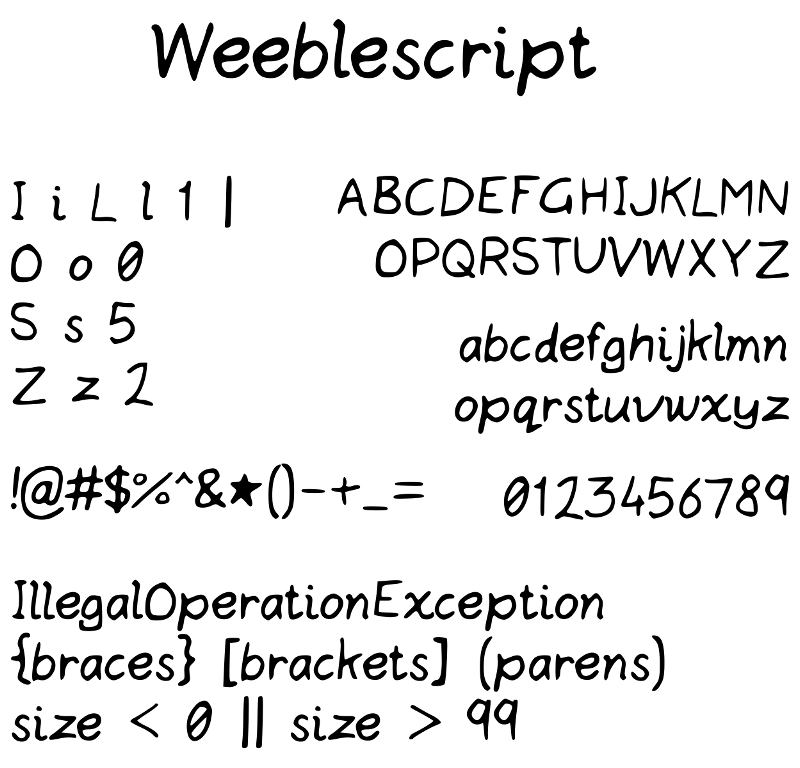

# Weeblescript

A font for making informal diagrams in a scribbly style, while taking care to remain unambiguous around commonly confused characters. I made this to illustrate programming diagrams when I found existing fonts like Comic Sans and Schoolbell didn't quite meet my needs. The source is a BirdFont file.

[Download here.](https://github.com/weeble/weeblescript-font/releases)
